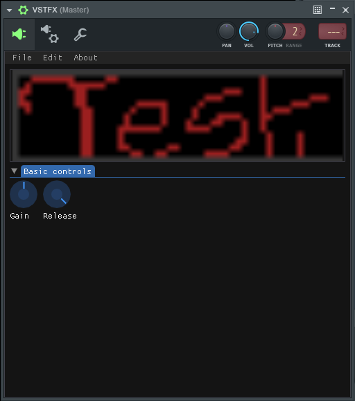

# VSTi 2.4 Instrument Test (SDL + dear imgui)



Based off [this VSTi tutorial](https://mitxela.com/projects/vsti_tutorial).

Wanna know what this was tested with so far? MinGW x86 cross compiling to Windows from Linux. Yeah.

Some CMake options...
```
-DCMAKE_BUILD_TYPE:STRING=Release
-DCMAKE_CROSSCOMPILING_EMULATOR:FILEPATH=/usr/bin/i686-w64-mingw32-wine
-DCMAKE_CXX_IMPLICIT_INCLUDE_DIRECTORIES:PATH=/usr/i686-w64-mingw32/include
-DCMAKE_C_IMPLICIT_INCLUDE_DIRECTORIES:PATH=/usr/i686-w64-mingw32/include
-DCMAKE_INSTALL_PREFIX:PATH=/usr/i686-w64-mingw32
-DCMAKE_TOOLCHAIN_FILE:FILEPATH=/usr/share/mingw/toolchain-i686-w64-mingw32.cmake
```

Fewer DAWs support VST 3 right now, VST 2 became proprietary and VST works best in Windows. Thanks, Steinberg.

~~yes the patched imgui is from furnace~~
